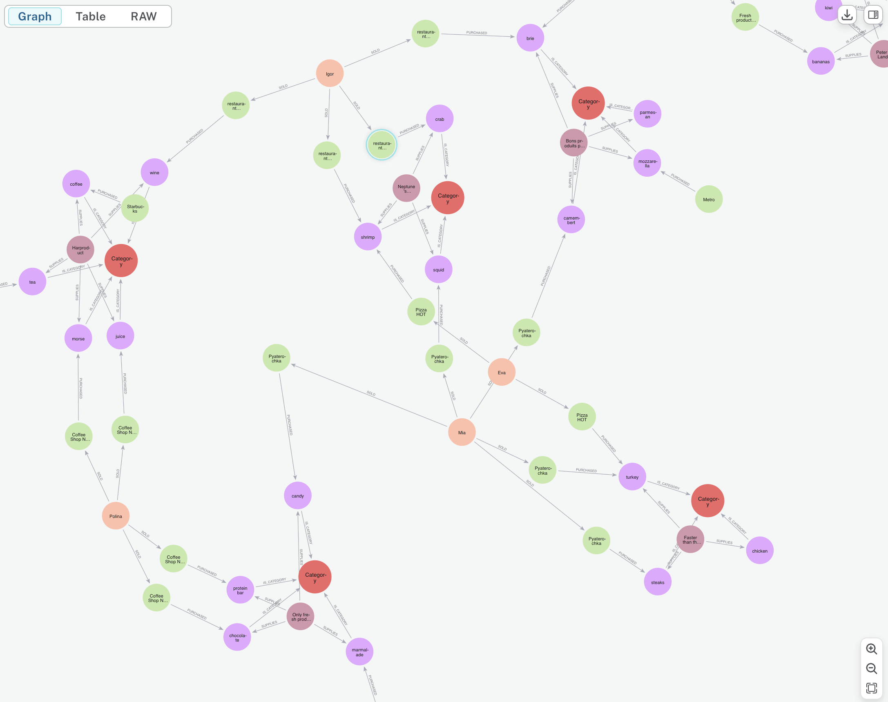

# NEO4J

### Пример реализации




### Пример запроса

```
MATCH (reader:Reader)
MATCH (unread_article:Article)
WHERE NOT ((reader)-->(unread_article))
MATCH (article:Article)
WHERE ((reader)-->(article))
MATCH (unread_article)-[:IS_IN]->()<-[:IS_IN]-(article)
CREATE(rec: RecommendationArticleToReader {nickname: reader. nickname })
WITH rec, unread_article, reader
MERGE(rec)-[rel:USED_TO_PROMOTE {email: reader.email}]->(unread_article)
RETURN rec, unread_article, rel;
```